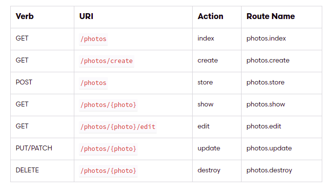

## 4 - 5 - 2021 🥁
- Resoure Routes
- Blade Temlate

## Resoure Routes 🐛

> Create a resoure include `create`, `index`, `edit`, `store`, `show`, `update`, `destroy.`

```bash
php artisan make:controller PhotoController --resource
```
---
*One resoure*
```php
Route::resource('photos', PhotoController::class);
```
*Controller Route*
```php
Route::get('/post', [PostController::class, 'store']);
```
*Mutiple resoures*
```php
Route::resources([
    'photos' => PhotoController::class,
    'posts' => PostController::class,
]);
```
**Actions Handled By Resource Controller**



## Blade Template 🐛
> Create a blade into `/resources/views` and folder view > `name.blade.php`


```php
// layout.blade.php

<body id="layout">
    @if ($name === 'datkira')
        @include('view.name', ['status' => $name])
    @else
        go go go
    @endif
</body>
```
```php
// name.blade.php

<p>This is status: {{$status}}</p>
```

```php
// app/Http/Controllers/PostControllder.php

public function layout($name) {
  return view('layout', compact('name'));
}
```
